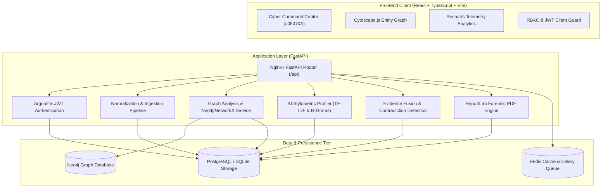

# DARKTRACE-X // System Architecture Specification

## 1. Architectural Philosophy

DARKTRACE-X is designed as an evidence-grounded, human-in-the-loop cyber threat intelligence and attribution system. It follows the core investigative sequence:

```
COLLECT
   ↓
NORMALIZE
   ↓
EXTRACT
   ↓
RESOLVE
   ↓
CORRELATE
   ↓
ANALYZE
   ↓
FUSE EVIDENCE
   ↓
CHECK CONTRADICTIONS
   ↓
GENERATE ASSESSMENT
   ↓
HUMAN REVIEW
```

---

## 2. Component Diagram



---

## 3. Core Engine Mechanics

### 3.1 Entity Resolution & Normalization
Identifiers are normalized (lowercasing, symbol replacement, hash indexing) while preserving raw source values. Potential links are generated as candidate relationships rather than automatic merges.

### 3.2 Evidence Fusion & Contradiction Detection
Multi-factor signals (Cryptographic PGP keys, origin hosting IP correlations, stylometric cosine similarity) are weighted. Crucially, the system actively checks for contradictory evidence (divergent operational timelines, opposing timezones) before outputting an analytical assessment.

### 3.3 Evidence Integrity
Every evidence record computes and validates a SHA-256 hash across stored content. If a record has been tampered with or modified outside authorized channels, the system immediately flags `EVIDENCE INTEGRITY WARNING`.
